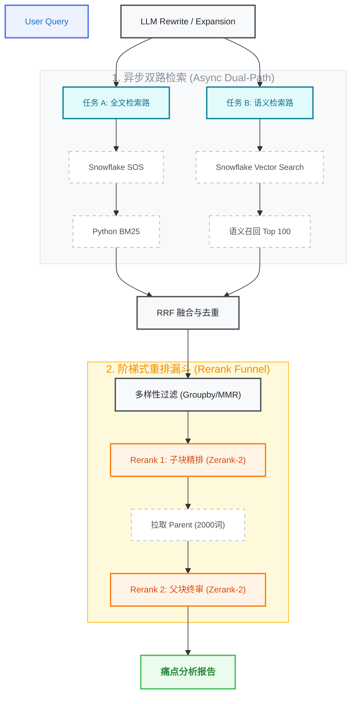

# 录音转义文本 RAG 系统架构设计方案

## 1. 业务愿景
针对海量录音转义文本，通过“底层索引脱水 + 高层逻辑评分”的架构，实现精准的客户痛点发现。系统需在 **1 秒内**完成检索，并确保不因文本碎片化而产生误判。

## 2. 核心架构图


## 3. 核心设计策略

### 3.1 核心分块逻辑 (Parent-Child Strategy)
*   **Child Chunk (子块):** 由 LLM 预先从原文提取，包含 `[Metadata]` + `[Insight Summary]` + `[Original Quote]`。用于初步检索和快速精排。
*   **Parent Chunk (父块):** 约 2000 词的录音原文上下文。用于最终事实核验。
*   **存储环境:** Snowflake (开启 SOS 搜索优化与向量列索引)。

### 3.2 检索阶段：异步并发处理 (Async Dual-Path Retrieval)
系统接收到 Query 后，通过 `asyncio` 并行开启两个独立任务：

#### 任务 A：全文检索路 (Keyword Path) —— “预膨胀”生产方案
1.  **LLM Rewrite (关键词“预膨胀”):** 
    *   **背景:** Snowflake `SEARCH()` 不支持 `*` 或 `%` 通配符。
    *   **策略:** 让 LLM 在第一步就把活干了。在提取关键词时，主动输出词根及其所有常见变体（复数、时态）。
    *   **Prompt 示例:** "Extract keywords and their common variations (singular/plural/tense). Output them as a space-separated list."
    *   **LLM 输出示例:** `user users concern concerns concerned issue issues`
2.  **Snowflake 精简 SQL 召回与初步评分:**
    *   **SQL 逻辑:**
        ```sql
        SELECT 
            chunk_id, child_text,
            -- 评分逻辑：用正则表达式给所有变体打分，确保变体频率高的排在前面
            (REGEXP_COUNT(child_text, 'user\w*', 1, 'i') + 
             REGEXP_COUNT(child_text, 'concern\w*', 1, 'i') + 
             REGEXP_COUNT(child_text, 'issue\w*', 1, 'i')) as simple_score
        FROM product_insights
        -- SEARCH 默认是 OR 逻辑，能毫秒级捞出包含任何任一变体的候选集
        WHERE SEARCH(child_text, 'user users concern concerns concerned issue issues') 
        ORDER BY simple_score DESC
        LIMIT 500;
        ```
    *   **为什么最稳？** 避开了通配符限制；保持了高速 SOS 索引；利用 `REGEXP_COUNT` 解决了初步排序问题。

#### 3.2.1.1 深度解析：为什么 REGEXP_COUNT 评分是关键？
在大规模数据场景下，该设计实现了“先全速脱水，再精准打分”的闭环：
*   **变体权重合并 (Variant Aggregation):** `REGEXP_COUNT(text, 'concern\w*')` 会自动将 `concern`, `concerns`, `concerned` 等变体项统统计入同一个分值。这确保了无论客户使用何种语法，只要“概念”命中，权重就会叠加。
*   **模拟词频排序 (TF-Ranking):** Snowflake 的 `SEARCH()` 本身只负责“有无”而不负责“相关性”。通过正则计数，我们手动构建了一个“轻量级词频得分”，确保提到关键词频率更高的片段（即便靠变体命中）能排在 Top 500 的前列，防止在 `LIMIT` 环节丢失高质量证据。
*   **性能平衡:** `SEARCH()` 利用 SOS 索引完成 99% 的过滤工作，剩下的 `REGEXP_COUNT` 仅对索引命中的几千行候选集进行计算，整体延迟依然保持在毫秒级。

3.  **Python BM25 精排:** 拉取 Top 500 个子块在内存中进行 BM25 评分（考虑 IDF 权重），输出 Top 100。

#### 复合鲁棒性：为什么不担心“漏搜变体”？
*   **向量路兜底:** 如果 LLM 没膨胀出某个偏门的变体（如 `worrying`），我们的 **BGE-M3 向量路** 依然会因为它在语义上的接近性将其捞回。
*   **双路融合 (RRF):** 只要任何一路捕获了变体，它就会进入后续的精排漏斗。

#### 任务 B：语义检索路 (Vector Path)
1.  **LLM Rewrite (Expansion):** 进行 HyDE 或近义词扩展，重点在于**意图识别与补全**。
    *   **策略:** 不同于全文路的“脱水”，向量路通过 LLM 丰富 Query 的语义背景，确保能匹配到语义相近但措辞不同的片段。
2.  **Snowflake Vector Search:** 使用 BGE-M3 向量进行余弦相似度检索，输出 Top 100。

### 3.3 排序阶段：两次 Rerank 阶梯漏斗 (The Rerank Funnel)
1.  **RRF 融合与去重:** 综合两路排名，并按 `meeting_id` 去重（确保结果广度）。
2.  **Rerank 1 —— 子块精排 (Speed Index):** 针对 100 个 Child Chunks 使用 **Zerank-2**。
    *   **实现细节:** 区别于向量检索（Embedding Similarity），此处的 Rerank 是 **Text-to-Text** 的深度比对。模型会读取 Child Chunk 中的 `[Insight Summary]` 原文，判断其逻辑意图是否真正匹配用户 Query，从而剔除向量检索中的“误读”项。
3.  **Rerank 2 —— 父块终审 (Truth Index):** 针对 Top 20 对应的 2000 词 Parent Chunks。
    *   **实现细节:** 此步**不需要 embedding**。系统根据 ID 从数据库（Snowflake/S3）动态拉取**原文长文本**，直接与 Query 一起输入 Zerank-2。利用 Cross-Attention 对全量原文进行深度逻辑扫描。

### 3.4 设计决策：为什么是双路 Rerank 与 Zerank-2？

#### 1. 为什么做两次 Rerank？ (阶梯式过滤策略)
*   **兼顾吞吐量与性能:** 
    *   **第一层 (Child):** 处理 100 个片段。子块短小精悍，Rerank 速度极快。其目的是“**降噪**”，通过模型的逻辑理解能力（而非简单的向量匹配）快速筛掉 80% 与意图无关的信息。
    *   **第二层 (Parent):** 只处理 Top 20。此时需要深入 2000 词的长文本上下文。如果一开始就对 100 个 2000 词的长文本进行 Rerank，会导致严重的推理延迟和成本爆炸。
*   **确保“真相” (Truth):** 痛点往往隐藏在长对话中。第一层找到的是“疑似”痛点，第二层通过分析长上下文，确认该痛点是否被后续对话修正、反转或仅是误解。

#### 2. 为什么选择 Zerank-2？
*   **深度上下文理解 (Cross-Attention):** 不同于向量检索的“语义压缩”，Zerank-2 采用 **Cross-Encoder 架构**。它将 Query 和 Document (特别是 2000 词的父块) 同时输入模型进行交叉权重计算。这意味着它能真正“读懂”上下文中的转折、语气和逻辑因果。
*   **长文本支持:** Zerank-2 优化的 Token 窗口和推理架构可以有效处理 8k 甚至更长的上下文，是“父块终审”阶段的核心。
*   **逻辑推理精度:** 相比传统的交叉编码器，Zerank-2 在复杂语义逻辑检索（如判断“客户是在抱怨还是在咨询”）上表现出更高的一致性。
*   **高性能/易于集成:** 它可以提供高性能的推理服务，在满足 SLA (< 1s) 的前提下，提供接近 SOTA 的排序精度。

### 3.5 语义多样性策略：MMR 还是 Groupby？

在当前场景中，**`groupby('meeting_id')` 的优先级高于 MMR (Maximal Marginal Relevance)**。

#### 1. 为什么 Groupby 更重要？
*   **来源多样性 (Source Breadth):** 业务核心目标是统计“有多少不同客户提到了该痛点”。如果 Top 10 全部来自同一个 Meeting，会导致统计片面。按 `meeting_id` 降采样（如每场会议仅保留前 3 个片段）能确保召回结果的广度。
*   **Zerank-2 的天然去重:** 后续的 Zerank-2 重排以及最终的 LLM 生成阶段具备极强的逻辑识别能力。如果两个片段语义完全重复，Zerank-2 会自然地为其分配不同的权重，或在报告生成阶段由 LLM 自动合并。

#### 2. 什么时候该引入 MMR？
如果需求变为：**“请给我列出 5 个完全不同的痛点”**，则需要在 RRF 之后跑一遍 MMR。
*   **防啰嗦机制:** MMR 是一个“新鲜感”算法。当 Top 100 中充斥着对同一痛点的不同表述（如“登录慢”、“加载久”、“进不去”）时，MMR 能够确保喂给大模型的信息每一句都具备独立价值。

#### 3. 全链路位置总结
1.  **数据召回:** Snowflake SOS + Vector。
2.  **初筛去重:** `groupby('meeting_id')`（确保来源广度）。
3.  **多样性增强 (可选):** MMR（确保语义多样性）。
4.  **精排阶段:** Zerank-2 (子块 -> 父块)。

## 4. 全链路 Latency 预估 (SLA)

| 阶段 | 执行动作 | 耗时 (SLA) | 核心价值 |
| :--- | :--- | :--- | :--- |
| **异步并联** | 并发 2 个 LLM Rewrite | ~300ms | 准备最适合两路检索的“炮弹” |
| **数据召回** | Snowflake SOS + Vector | ~150ms | 百万级数据秒级脱水至 500 条 |
| **内存评分** | Python BM25 + RRF | ~30ms | 补偿 Snowflake 评分能力的缺失 |
| **子块重排** | Zerank-2 (Short context) | ~300ms | 极速收窄范围，降低 GPU 压力 |
| **父块重排** | Zerank-2 (Long context) | ~400ms | 消除幻觉，确保证据链完整 |
| **总计** | **End-to-End** | **< 1.0s** | **高性能、高精度的闭环 RAG** |

## 5. 架构最终闭环 (The Final Loop)

1.  **Rewrite:** LLM 生成“关键词词族” (Full Keywords Expansion)。
2.  **Recall:** Snowflake **SEARCH** (高速过滤) + **REGEXP_COUNT** (初步打分) + **Vector Search** (语义补偿)。
3.  **Rerank 1:** Python **Zerank-2** 对**子块文本**进行高精度语义核验，剔除 80% 噪音。
4.  **Rerank 2:** Python **Zerank-2** 对**父块原文** (2000词) 进行深度逻辑核验，确保证据链闭环。
5.  **Output:** 生成模型 (GPT-4) 基于 Top 10 真实客观的父块原文，产出具备极高可信度的痛点分析报告。
