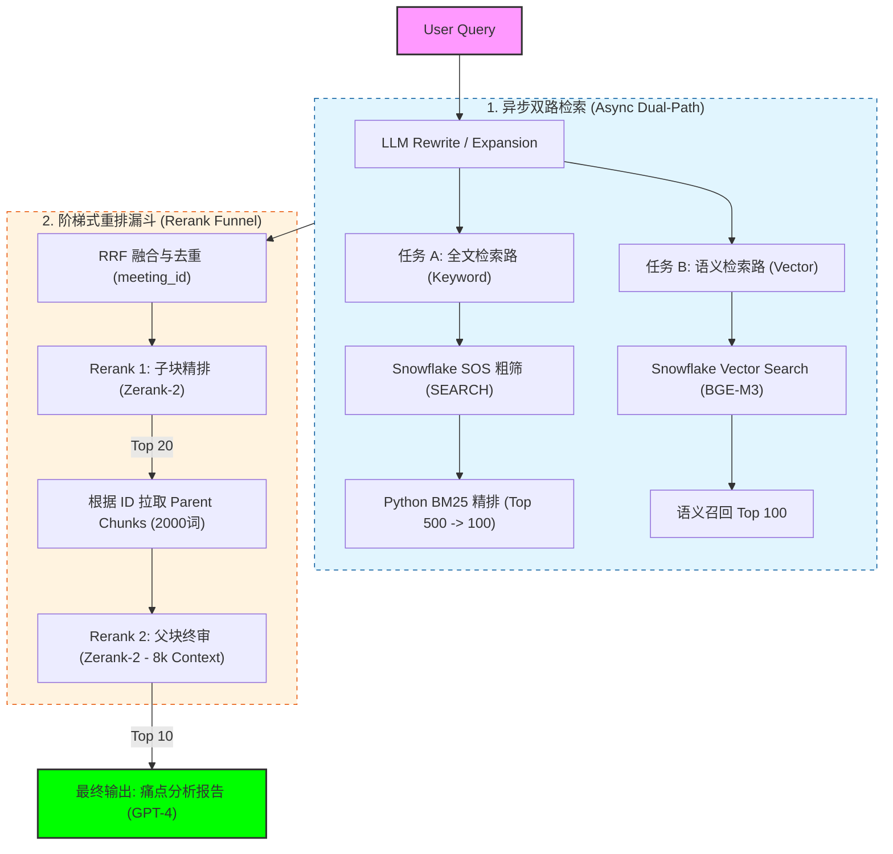

# 录音转义文本 RAG 系统架构设计方案

## 1. 业务愿景
针对海量录音转义文本，通过“底层索引脱水 + 高层逻辑评分”的架构，实现精准的客户痛点发现。系统需在 **1 秒内**完成检索，并确保不因文本碎片化而产生误判。

## 2. 核心架构图

## 3. 核心设计策略

### 3.1 核心分块逻辑 (Parent-Child Strategy)
*   **Child Chunk (子块):** 由 LLM 预先从原文提取，包含 `[Metadata]` + `[Insight Summary]` + `[Original Quote]`。用于初步检索和快速精排。
*   **Parent Chunk (父块):** 约 2000 词的录音原文上下文。用于最终事实核验。
*   **存储环境:** Snowflake (开启 SOS 搜索优化与向量列索引)。

### 3.2 检索阶段：异步并发处理 (Async Dual-Path Retrieval)
系统接收到 Query 后，通过 `asyncio` 并行开启两个独立任务：

#### 任务 A：全文检索路 (Keyword Path)
1.  **LLM Rewrite (Keywords):** 将自然语言转化为 3-5 个核心关键词。
    *   **Prompt 策略:** 
        > **System:** 你是一个搜索优化专家。请从用户的问题中提取 2-4 个最核心的搜索关键词 (Search Keywords)。
        > **要求:** 只返回关键词，用空格分隔；忽略虚词 (what, how, is 等)；将词还原为词根形式 (如 concerned -> concern)；如果语境包含隐含意思，请补充 1 个近义词 (如：烦 -> concern)。
2.  **Snowflake SOS 粗筛:** 使用 `SEARCH()` 定位行，利用 `REGEXP_COUNT` 计数过滤至 Top 500。
3.  **Python BM25 精排:** 在内存中进行 BM25 评分，输出 Top 100。

#### 任务 B：语义检索路 (Vector Path)
1.  **LLM Rewrite (Expansion):** 进行 HyDE 或近义词扩展，重点在于**意图识别与补全**。
    *   **策略:** 不同于全文路的“脱水”，向量路通过 LLM 丰富 Query 的语义背景，确保能匹配到语义相近但措辞不同的片段。
2.  **Snowflake Vector Search:** 使用 BGE-M3 向量进行余弦相似度检索，输出 Top 100。

### 3.3 排序阶段：两次 Rerank 阶梯漏斗 (The Rerank Funnel)
1.  **RRF 融合与去重:** 综合两路排名，并按 `meeting_id` 去重（确保结果广度）。
2.  **Rerank 1 —— 子块精排 (Speed Index):** 针对 100 个 Child Chunks 使用 **Zerank-2**。
    *   **实现细节:** 区别于向量检索（Embedding Similarity），此处的 Rerank 是 **Text-to-Text** 的深度比对。模型会读取 Child Chunk 中的 `[Insight Summary]` 原文，判断其逻辑意图是否真正匹配用户 Query，从而剔除向量检索中的“误读”项。
3.  **Rerank 2 —— 父块终审 (Truth Index):** 针对 Top 20 对应的 2000 词 Parent Chunks。
    *   **实现细节:** 此步**不需要 embedding**。系统根据 ID 从数据库（Snowflake/S3）动态拉取**原文长文本**，直接与 Query 一起输入 Zerank-2。利用 Cross-Attention 对全量原文进行深度逻辑扫描。

### 3.4 设计决策：为什么是双路 Rerank 与 Zerank-2？

#### 1. 为什么做两次 Rerank？ (阶梯式过滤策略)
*   **兼顾吞吐量与性能:** 
    *   **第一层 (Child):** 处理 100 个片段。子块短小精悍，Rerank 速度极快。其目的是“**降噪**”，通过模型的逻辑理解能力（而非简单的向量匹配）快速筛掉 80% 与意图无关的信息。
    *   **第二层 (Parent):** 只处理 Top 20。此时需要深入 2000 词的长文本上下文。如果一开始就对 100 个 2000 词的长文本进行 Rerank，会导致严重的推理延迟和成本爆炸。
*   **确保“真相” (Truth):** 痛点往往隐藏在长对话中。第一层找到的是“疑似”痛点，第二层通过分析长上下文，确认该痛点是否被后续对话修正、反转或仅是误解。

#### 2. 为什么选择 Zerank-2？
*   **深度上下文理解 (Cross-Attention):** 不同于向量检索的“语义压缩”，Zerank-2 采用 **Cross-Encoder 架构**。它将 Query 和 Document (特别是 2000 词的父块) 同时输入模型进行交叉权重计算。这意味着它能真正“读懂”上下文中的转折、语气和逻辑因果。
*   **长文本支持:** Zerank-2 优化的 Token 窗口和推理架构可以有效处理 8k 甚至更长的上下文，是“父块终审”阶段的核心。
*   **逻辑推理精度:** 相比传统的交叉编码器，Zerank-2 在复杂语义逻辑检索（如判断“客户是在抱怨还是在咨询”）上表现出更高的一致性。
*   **高性能/易于集成:** 它可以提供高性能的推理服务，在满足 SLA (< 1s) 的前提下，提供接近 SOTA 的排序精度。

## 4. 全链路 Latency 预估 (SLA)

| 阶段 | 执行动作 | 耗时 (SLA) | 核心价值 |
| :--- | :--- | :--- | :--- |
| **异步并联** | 并发 2 个 LLM Rewrite | ~300ms | 准备最适合两路检索的“炮弹” |
| **数据召回** | Snowflake SOS + Vector | ~150ms | 百万级数据秒级脱水至 500 条 |
| **内存评分** | Python BM25 + RRF | ~30ms | 补偿 Snowflake 评分能力的缺失 |
| **子块重排** | Zerank-2 (Short context) | ~300ms | 极速收窄范围，降低 GPU 压力 |
| **父块重排** | Zerank-2 (Long context) | ~400ms | 消除幻觉，确保证据链完整 |
| **总计** | **End-to-End** | **< 1.0s** | **高性能、高精度的闭环 RAG** |

## 5. 最终输出 (Return to LLM)
系统最终向生成模型（如 GPT-4）推送 **Top 10 的父块原文**。生成的报告将具备极高的可信度，因为每一项痛点分析都背靠 2000 词的实录原文作为支撑。
