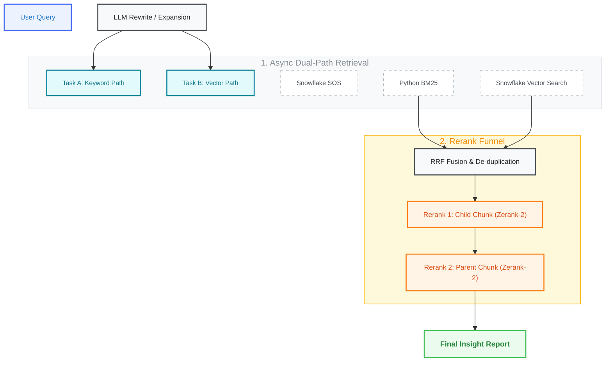

# RAG-Architecture-Design-Transcript

Ultimate Architecture Design: Async Dual-Path Retrieval & Tiered Reranking RAG System for Transcription Data.

## 🚀 Business Vision
Precise discovery of customer pain points from massive recording transcripts using a "Bottom-layer Index Dehydration + Top-layer Logic Scoring" architecture. The system achieves < 1.0s End-to-End latency with high factual accuracy.

## 🏗️ Architecture Overview

## 📄 Key Components
- **[RAG Architecture Design](RAG_Architecture_Design.md):** Detailed technical documentation.
- **Parent-Child Strategy:** Context-aware retrieval ensuring truthfulness.
- **Async Dual-Path:** Combining Keyword (Snowflake SOS) and Semantic (Vector) search.
- **Tiered Reranking:** Escalating from short summaries to 8k context for ultimate precision.

## ⏱️ Latency SLA
| Stage | Action | Latency |
| :--- | :--- | :--- |
| **Retrieval** | Async Rewrite + Recall | ~450ms |
| **Rerank 1** | Child Chunk Scoring | ~300ms |
| **Rerank 2** | Parent Chunk Final Audit | ~400ms |
| **Total** | **End-to-End** | **< 1.0s (Parallelized)** |
